# Design Document: Roblox Action Game

## Overview

This document defines the technical design for a competitive shooter game on the Roblox platform. The game features fast-paced gun combat across themed maps with Team Deathmatch (1v1–5v5) and Free-for-All (2–10 players) modes. Players earn coins and gems through gameplay, unlock weapons across rarity tiers (Common → Mythic), equip combat abilities, earn kill streaks, and progress through a leveling and prestige system.

The architecture follows a strict Server/Client/Shared pattern managed via Rojo file sync. All authoritative game state lives on the server, clients handle rendering, input, and UI, and shared modules define data structures, constants, and utility functions used by both sides. This design prioritizes security (server-authoritative hit detection, validated remotes), performance (client-side VFX, minimal replication), and cross-platform support (PC, Console, Mobile).

## Architecture

### High-Level System Architecture

```mermaid
graph TD
    subgraph Client["Client (LocalScript)"]
        InputController[Input Controller]
        HUD[HUD Manager]
        WeaponView[Weapon View Model]
        AbilityUI[Ability UI]
        EmoteWheel[Emote Wheel]
        ReplayViewer[Replay Viewer]
        SettingsUI[Settings UI]
        PingUI[Ping UI]
        ChestUI[Chest Opening UI]
        ShopUI[Shop UI]
    end

    subgraph Shared["Shared (ModuleScript)"]
        WeaponDefs[Weapon Definitions]
        AbilityDefs[Ability Definitions]
        MapDefs[Map Definitions]
        Constants[Game Constants]
        Types[Type Definitions]
        RarityConfig[Rarity Config]
        StreakDefs[Streak Definitions]
    end

    subgraph Server["Server (Script)"]
        CombatSystem[Combat System]
        MatchManager[Match Manager]
        WeaponServer[Weapon Server]
        AbilityServer[Ability Server]
        EconomyService[Economy Service]
        ChestSystem[Chest System]
        KillStreakMgr[Kill Streak Manager]
        ProgressionEngine[Progression Engine]
        MasterySystem[Mastery System]
        FinisherSystem[Finisher System]
        MatchmakingService[Matchmaking Service]
        SpawnSystem[Spawn System]
        MapSystem[Map System]
        PingServer[Ping Server]
        AFK_Detector[AFK Detector]
        DataService[Data Persistence Service]
        AntiExploit[Anti-Exploit Validator]
        ReplayRecorder[Replay Recorder]
    end

    InputController -->|RemoteEvent| CombatSystem
    InputController -->|RemoteEvent| AbilityServer
    InputController -->|RemoteEvent| PingServer
    CombatSystem -->|RemoteEvent| HUD
    MatchManager -->|RemoteEvent| HUD
    EconomyService -->|RemoteEvent| ShopUI
    ChestSystem -->|RemoteEvent| ChestUI
    ReplayRecorder -->|RemoteEvent| ReplayViewer
    DataService -->|DataStoreService| Roblox[(Roblox DataStore)]
    
    CombatSystem --> WeaponDefs
    AbilityServer --> AbilityDefs
    WeaponServer --> WeaponDefs
    WeaponView --> WeaponDefs
    MatchManager --> MapDefs
    AbilityUI --> AbilityDefs

```



### Rojo Project Structure

```
src/
├── Server/
│   ├── Services/
│   │   ├── CombatService.server.luau
│   │   ├── MatchService.server.luau
│   │   ├── EconomyService.server.luau
│   │   ├── ChestService.server.luau
│   │   ├── ProgressionService.server.luau
│   │   ├── MasteryService.server.luau
│   │   ├── MatchmakingService.server.luau
│   │   └── DataPersistenceService.server.luau
│   ├── Systems/
│   │   ├── KillStreakManager.server.luau
│   │   ├── SpawnSystem.server.luau
│   │   ├── MapSystem.server.luau
│   │   ├── AFKDetector.server.luau
│   │   ├── AntiExploitValidator.server.luau
│   │   ├── PingSystem.server.luau
│   │   ├── FinisherSystem.server.luau
│   │   └── ReplayRecorder.server.luau
│   └── Init.server.luau
├── Client/
│   ├── Controllers/
│   │   ├── InputController.client.luau
│   │   ├── WeaponViewController.client.luau
│   │   ├── HUDController.client.luau
│   │   ├── AbilityUIController.client.luau
│   │   ├── EmoteWheelController.client.luau
│   │   ├── ReplayController.client.luau
│   │   ├── SettingsController.client.luau
│   │   ├── ShopController.client.luau
│   │   ├── ChestUIController.client.luau
│   │   └── PingUIController.client.luau
│   └── Init.client.luau
├── Shared/
│   ├── Definitions/
│   │   ├── WeaponDefinitions.luau
│   │   ├── AbilityDefinitions.luau
│   │   ├── MapDefinitions.luau
│   │   ├── RarityConfig.luau
│   │   ├── StreakDefinitions.luau
│   │   ├── FinisherDefinitions.luau
│   │   └── ChestDefinitions.luau
│   ├── Types/
│   │   ├── PlayerData.luau
│   │   ├── WeaponTypes.luau
│   │   ├── MatchTypes.luau
│   │   └── EconomyTypes.luau
│   ├── Utils/
│   │   ├── MathUtils.luau
│   │   ├── TableUtils.luau
│   │   └── ValidationUtils.luau
│   └── Constants.luau
└── default.project.json
```

### Network Boundary Design

All communication between Client and Server flows through validated RemoteEvents and RemoteFunctions:

| Direction | Remote Name | Purpose |
|-----------|-------------|---------|
| Client → Server | `FireWeapon` | Send fire input with aim direction |
| Client → Server | `ReloadWeapon` | Request weapon reload |
| Client → Server | `ActivateAbility` | Request ability activation (slot index) |
| Client → Server | `SendPing` | Team ping at world position |
| Client → Server | `SendCallout` | Quick callout message selection |
| Client → Server | `PlayEmote` | Emote wheel selection |
| Client → Server | `PurchaseItem` | Economy purchase request |
| Client → Server | `EquipLoadout` | Loadout change request |
| Client → Server | `UpdateSettings` | Settings save request |
| Client → Server | `JoinQueue` | Matchmaking queue request |
| Server → Client | `DamageIndicator` | Directional damage feedback |
| Server → Client | `KillFeed` | Kill notification data |
| Server → Client | `MatchState` | Timer, scores, phase changes |
| Server → Client | `StreakNotification` | Kill streak announcements |
| Server → Client | `ChestAwarded` | Chest opening trigger with rewards |
| Server → Client | `ReplayData` | Final kill replay payload |
| Server → Client | `EconomyUpdate` | Currency balance changes |
| Server → Client | `AbilityCooldown` | Cooldown sync |

### Server Authority Model

The server maintains authoritative control over:
- **Health & Damage**: All hit detection via server-side raycasting, damage calculation with rarity bonuses
- **Economy**: Coin/gem balances, purchases, and rewards validated entirely server-side
- **Match State**: Timer, scores, kill attribution, round lifecycle
- **Ability Cooldowns**: Cooldown timers tracked server-side, client only renders UI
- **Playtime**: AFK detection and chest playtime tracking on server
- **Progression**: XP, level, prestige, mastery kills all server-calculated

Clients are responsible for:
- Input capture and transmission
- Weapon view models (first-person arms, animations)
- HUD rendering (ScreenGui)
- VFX (finisher effects, hit markers, damage indicators)
- Audio playback
- Settings UI

## Components and Interfaces

### CombatService (Server)

The core combat module handling weapon firing, hit detection, and damage.

```luau
-- CombatService Interface
type CombatService = {
    -- Called when client fires; performs server-side raycast
    handleFireRequest: (player: Player, aimOrigin: Vector3, aimDirection: Vector3) -> (),
    
    -- Performs raycast and returns hit result
    performRaycast: (origin: Vector3, direction: Vector3, range: number, ignoreList: {Instance}) -> RaycastResult?,
    
    -- Calculates damage with rarity bonus and headshot multiplier
    calculateDamage: (baseDamage: number, rarityTier: string, isHeadshot: boolean) -> number,
    
    -- Applies damage to target, handles kill attribution
    applyDamage: (attacker: Player, target: Player, damage: number, weaponId: string) -> (),
    
    -- Registers a kill event, notifies dependent systems
    registerKill: (attacker: Player, victim: Player, weaponId: string, isHeadshot: boolean) -> (),
}
```

### MatchManager (Server)

Controls match lifecycle from queue to results.

```luau
type MatchState = "Waiting" | "Countdown" | "Active" | "Ending" | "Results"

type MatchConfig = {
    mode: "TDM" | "FFA",
    teamSize: number, -- 1-5 for TDM, ignored for FFA
    maxPlayers: number,
    timeLimit: number, -- seconds (default 300)
    mapId: string,
    weaponRestrictions: {string}?, -- optional restricted weapon list
}

type MatchManager = {
    createMatch: (config: MatchConfig) -> string, -- returns matchId
    startCountdown: (matchId: string) -> (),
    endMatch: (matchId: string) -> (),
    addKill: (matchId: string, player: Player, team: string?) -> (),
    addDeath: (matchId: string, player: Player) -> (),
    getScoreboard: (matchId: string) -> {PlayerMatchStats},
    determineWinner: (matchId: string) -> Player | string, -- player or team name
}
```

### EconomyService (Server)

Manages dual-currency economy with full server validation.

```luau
type EconomyService = {
    -- Currency operations
    getBalance: (player: Player) -> (number, number), -- coins, gems
    addCoins: (player: Player, amount: number, reason: string) -> boolean,
    addGems: (player: Player, amount: number, reason: string) -> boolean,
    spendCoins: (player: Player, amount: number, itemId: string) -> boolean,
    spendGems: (player: Player, amount: number, itemId: string) -> boolean,
    
    -- Purchase validation
    validatePurchase: (player: Player, itemId: string, currency: string) -> (boolean, string?),
    processPurchase: (player: Player, itemId: string) -> boolean,
    
    -- Robux receipt processing
    processRobuxReceipt: (receiptInfo: table) -> Enum.ProductPurchaseDecision,
    
    -- Reward distribution
    awardMatchRewards: (player: Player, stats: PlayerMatchStats) -> {coins: number, gems: number},
}
```

### DataPersistenceService (Server)

Handles all DataStore operations with retry logic.

```luau
type PlayerSaveData = {
    coins: number,
    gems: number,
    ownedWeapons: {string},
    ownedAbilities: {string},
    ownedEmotes: {string},
    ownedFinishers: {string},
    equippedLoadout: LoadoutData,
    level: number,
    xp: number,
    prestige: number,
    masteryKills: {[string]: number}, -- weaponId -> kill count
    settings: PlayerSettings,
    playtimeMinutes: number,
    loginStreak: number,
    lastLoginDate: string,
    dailyCycleDay: number,
}

type DataPersistenceService = {
    loadPlayerData: (player: Player) -> PlayerSaveData?,
    savePlayerData: (player: Player) -> boolean,
    autoSave: () -> (), -- periodic save for all players
    retryWithBackoff: (key: string, data: PlayerSaveData, attempt: number) -> boolean,
}
```

### WeaponSystem (Shared)

Weapon definitions and stat calculations shared between server and client.

```luau
type WeaponStats = {
    id: string,
    name: string,
    category: "AssaultRifle" | "Shotgun" | "Sniper" | "Revolver" | "DualPistols" | "RocketLauncher" | "Crossbow" | "LMG" | "Knife" | "Fists" | "Scythe",
    rarity: "Common" | "Rare" | "Epic" | "Legendary" | "Mythic",
    damage: number,
    fireRate: number, -- rounds per second
    range: number, -- studs
    reloadTime: number, -- seconds
    magazineSize: number,
    movementSpeedModifier: number, -- multiplier (e.g., 0.85 for LMG)
    headshotMultiplier: number, -- default 1.5
    cost: {currency: string, amount: number}?,
}

type WeaponDefinitions = {
    getWeapon: (weaponId: string) -> WeaponStats?,
    getWeaponsByCategory: (category: string) -> {WeaponStats},
    getWeaponsByRarity: (rarity: string) -> {WeaponStats},
    calculateEffectiveStats: (weapon: WeaponStats) -> WeaponStats, -- applies rarity bonus
    getRarityBonus: (rarity: string) -> number, -- 0, 0.05, 0.10, 0.15, 0.20
}
```

### AbilitySystem (Server + Shared)

```luau
type AbilityDefinition = {
    id: string,
    name: string,
    cooldown: number, -- seconds
    cost: number, -- coins (0 for free)
    effect: string, -- "dash" | "heal" | "grapple" | "shield" | "speedboost"
    params: {[string]: any}, -- effect-specific parameters
}

type AbilityServer = {
    activateAbility: (player: Player, slotIndex: number) -> boolean,
    isOnCooldown: (player: Player, abilityId: string) -> (boolean, number?), -- isOnCD, remainingTime
    getEquippedAbilities: (player: Player) -> {AbilityDefinition?}, -- max 2 slots
    applyEffect: (player: Player, ability: AbilityDefinition) -> (),
}
```

### ProgressionEngine (Server)

```luau
type ProgressionEngine = {
    addXP: (player: Player, amount: number, source: string) -> (number, boolean), -- newXP, didLevelUp
    getLevel: (player: Player) -> number,
    getPrestige: (player: Player) -> number,
    activatePrestige: (player: Player) -> boolean,
    calculateMatchXP: (stats: PlayerMatchStats) -> number,
    getLevelReward: (level: number) -> LevelReward?,
}
```

### ChestSystem (Server)

```luau
type ChestTier = "Bronze" | "Silver" | "Gold"

type ChestReward = {
    items: {string}, -- item IDs
    coins: number,
    gems: number,
}

type ChestSystem = {
    updatePlaytime: (player: Player, deltaMinutes: number) -> ChestTier?, -- returns tier if chest earned
    generateRewards: (player: Player, tier: ChestTier) -> ChestReward,
    handleDuplicate: (player: Player, itemId: string) -> number, -- returns coin equivalent
    getPlaytimeProgress: (player: Player) -> {bronze: number, silver: number, gold: number}, -- minutes remaining
}
```

### KillStreakManager (Server)

```luau
type StreakReward = {
    streakCount: number,
    name: string,
    effect: string,
    params: {[string]: any},
}

type KillStreakManager = {
    registerKill: (player: Player) -> StreakReward?, -- returns reward if milestone hit
    registerDeath: (player: Player) -> (),
    getCurrentStreak: (player: Player) -> number,
    applyStreakReward: (player: Player, reward: StreakReward) -> (),
}
```

### SpawnSystem (Server)

```luau
type SpawnSystem = {
    getSpawnPoint: (player: Player, mapId: string, enemyPositions: {Vector3}) -> CFrame,
    startRespawnTimer: (player: Player, callback: () -> ()) -> (),
    applySpawnProtection: (player: Player) -> (),
    removeSpawnProtection: (player: Player) -> (),
    isSpawnProtected: (player: Player) -> boolean,
}
```

### HUDController (Client)

```luau
type HUDController = {
    updateHealth: (current: number, max: number) -> (),
    updateAmmo: (current: number, magazine: number) -> (),
    updateKDA: (kills: number, deaths: number, assists: number) -> (),
    updateTimer: (secondsRemaining: number) -> (),
    updateAbilityCooldowns: (slot1: number?, slot2: number?) -> (),
    updateStreak: (count: number) -> (),
    showKillNotification: (victimName: string, weaponId: string) -> (),
    showDamageIndicator: (direction: Vector3) -> (),
    showMatchResults: (results: MatchResults) -> (),
    showMinimap: (teammatePositions: {Vector3}) -> (), -- TDM only
    toggleScoreboard: (show: boolean, data: {PlayerMatchStats}) -> (),
}
```

### Anti-Exploit Validator (Server)

```luau
type AntiExploitValidator = {
    validateRemoteArgs: (player: Player, remoteName: string, args: {any}) -> (boolean, string?),
    checkRateLimit: (player: Player, remoteName: string) -> boolean,
    logViolation: (player: Player, violationType: string, details: string) -> (),
    getViolationCount: (player: Player) -> number,
}
```

## Data Models

### Player Persistent Data Schema

```luau
type PlayerSaveData = {
    -- Economy
    coins: number,           -- earned through gameplay
    gems: number,            -- premium earnable currency
    
    -- Inventory
    ownedWeapons: {string},      -- weapon IDs
    ownedAbilities: {string},    -- ability IDs  
    ownedEmotes: {string},       -- emote IDs
    ownedFinishers: {string},    -- finisher IDs
    ownedCamos: {[string]: {string}}, -- weaponId -> {camoId, ...}
    ownedSkins: {string},        -- cosmetic skin IDs
    
    -- Loadout
    equippedLoadout: {
        primaryWeapon: string?,
        secondaryWeapon: string?,
        meleeWeapon: string?,
        abilities: {string?},    -- max 2
        finisher: string?,
        emotes: {string?},       -- max 8
    },
    
    -- Progression
    level: number,               -- 1-100
    xp: number,                  -- current XP within level
    prestige: number,            -- 0-5
    
    -- Mastery
    masteryKills: {[string]: number}, -- weaponId -> total kills
    
    -- Settings
    settings: {
        sensitivity: number,     -- 0.1 to 5.0
        crosshair: {shape: string, color: string, size: number, opacity: number},
        audio: {master: number, sfx: number, music: number, voice: number},
        keybinds: {[string]: string}?,  -- PC only
        mobileOnlyMatchmaking: boolean,
    },
    
    -- Session Tracking
    playtimeMinutes: number,     -- total active playtime
    chestPlaytime: {bronze: number, silver: number, gold: number}, -- current cycle minutes
    loginStreak: number,         -- consecutive days
    lastLoginDate: string,       -- ISO date string
    dailyCycleDay: number,       -- 1-4 for daily login rewards
    
    -- Stats
    totalKills: number,
    totalDeaths: number,
    totalWins: number,
    totalMatches: number,
}
```

### Match Session Data (Server Memory Only)

```luau
type MatchSession = {
    matchId: string,
    config: MatchConfig,
    state: MatchState,
    startTime: number,
    endTime: number?,
    
    -- Teams (TDM) or individual players (FFA)
    teams: {[string]: {Player}}?,  -- teamName -> players
    players: {Player},
    
    -- Scoring
    scores: {[string]: number},    -- playerId/teamName -> kills
    playerStats: {[string]: PlayerMatchStats},
    
    -- Streak tracking
    streaks: {[string]: number},   -- playerId -> current streak
    
    -- Final kill tracking
    lastKillData: {
        attacker: Player?,
        victim: Player?,
        weaponId: string?,
        timestamp: number?,
    }?,
}

type PlayerMatchStats = {
    kills: number,
    deaths: number,
    assists: number,
    damageDealt: number,
    highestStreak: number,
    headshotKills: number,
}
```

### Weapon Definition Data

```luau
-- Example weapon entries
local Weapons = {
    {
        id = "ar_standard",
        name = "Standard Rifle",
        category = "AssaultRifle",
        rarity = "Common",
        damage = 20,
        fireRate = 8,
        range = 100,
        reloadTime = 2.0,
        magazineSize = 30,
        movementSpeedModifier = 1.0,
        headshotMultiplier = 1.5,
        cost = nil, -- free starter
    },
    {
        id = "sniper_bolt",
        name = "Bolt Action",
        category = "Sniper",
        rarity = "Rare",
        damage = 85,
        fireRate = 0.8,
        range = 250,
        reloadTime = 3.5,
        magazineSize = 5,
        movementSpeedModifier = 0.9,
        headshotMultiplier = 1.5,
        cost = {currency = "coins", amount = 1000},
    },
}
```

### Rarity Bonus Configuration

```luau
local RarityConfig = {
    Common    = { statBonus = 0.00, features = {} },
    Rare      = { statBonus = 0.05, features = {} },
    Epic      = { statBonus = 0.10, features = {"uniqueReloadAnim"} },
    Legendary = { statBonus = 0.15, features = {"uniqueFireSound", "particleTrail"} },
    Mythic    = { statBonus = 0.20, features = {"uniqueKillEffect", "glowingModel"} },
}
```

### Economy Pricing Tables

```luau
local Pricing = {
    weapons = {
        Rare = {min = 500, max = 1500, currency = "coins"},
        Epic = {min = 2000, max = 4000, currency = "coins"},
        Legendary = {amount = 500, currency = "gems"},
        Mythic = {amount = 1000, currency = "gems"},
    },
    abilities = {
        dash = {cost = 0, currency = "coins"},
        heal = {cost = 500, currency = "coins"},
        grapple = {cost = 750, currency = "coins"},
        shield = {cost = 1000, currency = "coins"},
        speedboost = {cost = 600, currency = "coins"},
    },
    finishers = {min = 1000, max = 2500, currency = "coins"},
    emotes = {min = 200, max = 500, currency = "coins"},
}
```


## Correctness Properties

*A property is a characteristic or behavior that should hold true across all valid executions of a system—essentially, a formal statement about what the system should do. Properties serve as the bridge between human-readable specifications and machine-verifiable correctness guarantees.*

### Property 1: Damage Calculation Correctness

*For any* weapon with base damage D, rarity tier R (with bonus multiplier B), and hit type H (body or headshot with 1.5x multiplier), the final damage dealt SHALL equal D × (1 + B) × H, where B ∈ {0.00, 0.05, 0.10, 0.15, 0.20} and H ∈ {1.0, 1.5}.

**Validates: Requirements 1.2, 1.7, 2.5**

### Property 2: Reload State Blocks Firing

*For any* weapon in a reloading state, all fire input attempts SHALL be rejected and produce no shot, regardless of weapon type, rarity, or remaining reload duration.

**Validates: Requirements 1.4**

### Property 3: Weapon Stat Schema Completeness

*For any* weapon defined in the WeaponDefinitions table, the weapon SHALL contain all required stat fields (damage, fireRate, range, reloadTime, magazineSize, movementSpeedModifier) with values within their valid numeric ranges (all positive, movementSpeedModifier between 0.5 and 1.5).

**Validates: Requirements 2.6**

### Property 4: Movement Speed Modification

*For any* weapon with movement speed modifier M and any player with base speed S, equipping that weapon SHALL result in effective speed equal to S × M.

**Validates: Requirements 2.7**

### Property 5: Winner Determination with Tiebreaker

*For any* set of player match scores, the winner SHALL be the player/team with the most kills; when two or more players/teams have equal kills, the winner SHALL be the one with the fewest deaths.

**Validates: Requirements 3.3, 3.4**

### Property 6: Spawn Point Maximizes Enemy Distance

*For any* set of available spawn points and enemy positions, the selected spawn point SHALL be the one that maximizes the minimum distance to any enemy player.

**Validates: Requirements 3.6**

### Property 7: Ability Equip Slot Limit

*For any* sequence of ability equip operations on a player's loadout, the player SHALL never have more than 2 abilities equipped simultaneously.

**Validates: Requirements 4.2**

### Property 8: Ability Cooldown Enforcement

*For any* ability that has been activated, subsequent activation attempts for that ability SHALL be rejected while the cooldown timer is greater than zero, and SHALL succeed once the cooldown has elapsed.

**Validates: Requirements 4.3, 4.4**

### Property 9: Kill Streak Counter Consistency

*For any* sequence of kill and death events for a player, the streak counter SHALL always equal the number of consecutive kills since the player's last death (or since match start if no deaths have occurred), and SHALL reset to zero upon death.

**Validates: Requirements 5.1, 5.6**

### Property 10: Economy Transaction Integrity

*For any* valid purchase attempt where the player's balance is ≥ item cost, the transaction SHALL succeed and reduce the balance by exactly the item cost. For any purchase attempt where balance < cost, the transaction SHALL be rejected and the balance SHALL remain unchanged.

**Validates: Requirements 6.6, 7.6**

### Property 11: Consecutive Win Gem Reward

*For any* sequence of match results (win/loss), gems SHALL be awarded exactly when the player achieves a 3-consecutive-win milestone, and the consecutive counter SHALL reset after each award.

**Validates: Requirements 7.3**

### Property 12: Chest Playtime Thresholds

*For any* sequence of playtime increments, a Bronze chest SHALL be awarded at exactly 30 cumulative minutes, a Silver chest at 60 minutes, and a Gold chest at 120 minutes of active match playtime.

**Validates: Requirements 9.1, 9.2, 9.3**

### Property 13: Duplicate Item Conversion

*For any* chest reward containing a weapon the player already owns, the duplicate SHALL be converted to a coin value exactly equal to the weapon's original purchase price.

**Validates: Requirements 9.5**

### Property 14: Daily Login Reward Cycle

*For any* sequence of daily logins, the coin reward SHALL follow the 4-day cycle (25, 50, 75, 100 coins) and reset to Day 1 after Day 4. If a calendar day is missed, the login streak SHALL reset to Day 1.

**Validates: Requirements 11.1, 11.3**

### Property 15: XP Calculation Formula

*For any* completed match with K kills and win status W (boolean), the XP awarded SHALL equal 50 + (10 × K) + (25 × W), where W is 1 if the player won and 0 otherwise.

**Validates: Requirements 12.2**

### Property 16: Level and Prestige Cap Invariant

*For any* amount of XP accumulated, a player's level SHALL never exceed 100, and prestige SHALL never exceed 5. Level milestone rewards SHALL be granted at every multiple of 5.

**Validates: Requirements 12.1, 12.3, 12.5**

### Property 17: Weapon Mastery Camo Unlocks

*For any* weapon and kill count N, the unlocked camos SHALL be exactly: Bronze if N ≥ 50, Silver if N ≥ 100, Gold if N ≥ 250, Diamond if N ≥ 500. The per-weapon kill counter SHALL equal the total number of kills registered with that weapon.

**Validates: Requirements 13.1, 13.2, 13.3, 13.4, 13.5**

### Property 18: Ping Rate Limiting

*For any* sequence of ping attempts by a player, attempts occurring within 3 seconds of the player's last successful ping SHALL be rejected.

**Validates: Requirements 17.4**

### Property 19: Emote Equip Slot Limit

*For any* sequence of emote equip operations, a player SHALL never have more than 8 emotes equipped to the emote wheel simultaneously.

**Validates: Requirements 18.1**

### Property 20: Settings Sensitivity Clamping

*For any* sensitivity value V provided by the player, the stored sensitivity SHALL be clamped to the range [0.1, 5.0] inclusive.

**Validates: Requirements 20.1**

### Property 21: AFK Detection Timing

*For any* player input timeline during an active match, a warning SHALL appear after exactly 45 seconds of no input, and the player SHALL be removed after 60 total seconds of no input. Any input during the warning period SHALL cancel the AFK timer.

**Validates: Requirements 22.1, 22.2, 22.3**

### Property 22: Remote Rate Limiting

*For any* player and any single RemoteEvent, calls exceeding 60 per second SHALL be rejected. Calls within the 60/second limit SHALL be processed normally.

**Validates: Requirements 23.5**

### Property 23: DataStore Retry with Exponential Backoff

*For any* DataStore save failure sequence, the system SHALL retry up to 3 times with exponentially increasing delay between attempts. After 3 failed retries, the system SHALL alert the player and stop retrying.

**Validates: Requirements 24.4**

## Error Handling

### Network Errors

| Scenario | Handling |
|----------|----------|
| Client sends malformed RemoteEvent args | Server validates type/range, rejects request, logs violation |
| Client exceeds rate limit (60 calls/s/remote) | Server silently drops excess calls, increments violation counter |
| Client sends fire request for unowned weapon | Server rejects, logs exploit attempt |
| Client attempts economy modification | Server ignores, logs critical violation |

### DataStore Errors

| Scenario | Handling |
|----------|----------|
| DataStore read fails on player join | Retry 3x with exponential backoff; if all fail, use default data and warn player |
| DataStore write fails on player leave | Retry 3x with exponential backoff; queue failed saves for background retry |
| Auto-save fails | Log error, continue next auto-save cycle; data preserved in server memory |
| DataStore budget exhausted | Queue saves, process when budget replenishes |

### Match Errors

| Scenario | Handling |
|----------|----------|
| Player disconnects mid-match | Remove from match, save stats, redistribute teams if TDM |
| All players leave a match | Terminate match, no winner declared |
| Match fails to find spawn point | Fallback to map center with temporary invincibility |
| Map fails to load | Abort match start, return players to lobby, select alternate map |

### Combat Errors

| Scenario | Handling |
|----------|----------|
| Raycast hits nothing (range exceeded) | No damage applied, decrement ammo normally |
| Target dies to simultaneous hits | First hit processed kills target; subsequent hits discarded |
| Player fires with 0 ammo | Server rejects fire request, client shows "reload" prompt |
| Ability activation during spawn protection | Allow ability use (spawn protection covers incoming damage only) |

### Economy Errors

| Scenario | Handling |
|----------|----------|
| Robux receipt processing fails | Return `Enum.ProductPurchaseDecision.NotProcessedYet` for retry |
| Double-purchase attempt (race condition) | Server locks purchase operation per player, rejects concurrent attempts |
| Negative balance would result from transaction | Reject transaction, return error to client |
| Chest contains item from deleted/deprecated pool | Substitute with equivalent coin reward |

## Testing Strategy

### Unit Tests (Example-Based)

Unit tests cover specific scenarios, edge cases, and integration points:

- **Combat**: Verify specific damage values for known weapon/rarity/headshot combinations
- **Economy**: Verify exact coin/gem awards for kills, assists, wins, MVP, streaks
- **Kill Streaks**: Verify correct reward at each milestone (3, 5, 7, 10)
- **Match Lifecycle**: Verify state transitions (Waiting → Countdown → Active → Ending → Results)
- **Loadout**: Verify equip/unequip operations with valid and invalid items
- **Chest Rewards**: Verify correct reward tier contents
- **Prestige**: Verify prestige activation resets level and grants rewards
- **Finisher Triggers**: Verify finisher plays on final kill and streak milestone kills
- **Training Range**: Verify no XP/coins/gems awarded during practice
- **Settings**: Verify persistence and loading of all setting types

### Property-Based Tests

Property tests verify universal properties across all valid inputs. Each property test corresponds to a correctness property defined above.

**Framework**: [Luau property-based testing library or custom QuickCheck-style implementation]

**Configuration**:
- Minimum 100 iterations per property test
- Each test tagged with property reference comment

**Tag Format**: `-- Feature: roblox-action-game, Property {N}: {title}`

Property tests to implement:
1. Damage calculation across all weapon/rarity/headshot combinations (Property 1)
2. Reload state always blocks fire (Property 2)
3. All weapons have complete stat schemas (Property 3)
4. Movement speed = base × modifier for all weapons (Property 4)
5. Winner determination selects highest kills, then fewest deaths (Property 5)
6. Spawn point selection maximizes enemy distance (Property 6)
7. Ability slot never exceeds 2 (Property 7)
8. Cooldown blocks activation, expiry allows it (Property 8)
9. Kill streak counter matches consecutive kills since last death (Property 9)
10. Economy transactions maintain balance invariants (Property 10)
11. 3-consecutive-win gem awards fire at correct intervals (Property 11)
12. Chest thresholds trigger at 30/60/120 minutes (Property 12)
13. Duplicate items convert to correct coin value (Property 13)
14. Daily login cycle follows 4-day pattern with streak reset (Property 14)
15. XP formula: 50 + 10×kills + 25×win (Property 15)
16. Level ≤ 100, prestige ≤ 5, milestones at every 5 levels (Property 16)
17. Mastery camos unlock at correct kill thresholds (Property 17)
18. Pings rejected within 3-second window (Property 18)
19. Emote wheel never exceeds 8 slots (Property 19)
20. Sensitivity clamped to [0.1, 5.0] (Property 20)
21. AFK warning at 45s, removal at 60s, cancel on input (Property 21)
22. Remote calls rejected above 60/second (Property 22)
23. DataStore retry uses exponential backoff, max 3 attempts (Property 23)

### Integration Tests

Integration tests verify system interactions and external service behavior:

- **DataStore round-trip**: Save → Load produces identical PlayerSaveData
- **Match flow**: Queue → Matchmaking → Match Start → Kill → Score Update → Match End → Results
- **Economy persistence**: Earn coins → Save → Rejoin → Verify balance
- **Cross-system**: Kill → Streak Update → Economy Award → Mastery Increment → XP Award (all propagate correctly)
- **Robux processing**: MarketplaceService receipt → item granted → persisted
- **Anti-exploit**: Fabricated remote calls are rejected with logged violations

### Smoke Tests

- All 10 Common weapons exist in definitions
- 10-20 non-Common weapons exist
- All 8 weapon categories represented
- All 3 melee weapons defined
- All 5 abilities defined with correct costs/cooldowns
- All 5 maps defined with ≥ 8 spawn points each
- Both game modes (TDM, FFA) can be created
- All finisher types exist
- Default emotes (wave, thumbs up) available
